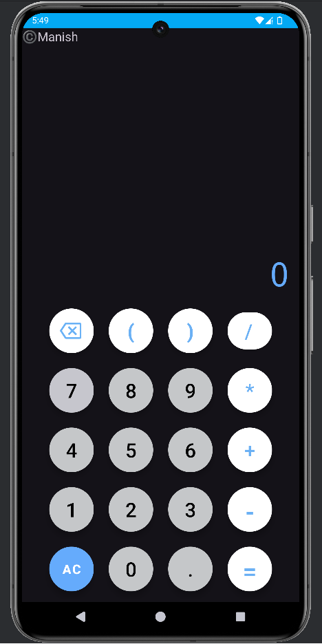

# Calculator App

Welcome to the Calculator App, a simple calculator developed in Java using Android Studio! This app features a user-friendly interface that allows users to perform basic arithmetic operations.

---

## Project Overview

This app was developed to demonstrate fundamental Android development skills, including:

- Creating a user interface with XML
- Handling user input and events
- Performing arithmetic calculations using Java

---

## Features

- **Arithmetic Operations**: Supports addition, subtraction, multiplication, and division.
- **User-Friendly Interface**: Easy input and clear display of results.
- **Real-Time Calculations**: See results instantly as you input numbers and select operations.

---

## Repository Contents

This repository contains the following files:

1. **Calc_Interface.png**: A screenshot of the app’s interface showcasing the calculator layout.
2. **CalC Java.docx**: The Java source code for handling calculations and managing user input/output.
3. **CalC Working.mp4**: A screen recording demonstrating the app's functionality in action.
4. **CalC xml.docx**: The XML layout code used to design the user interface in Android Studio.

---

## How to Run the App

1. Clone this repository to your local machine.
2. Open the project in **Android Studio**.
3. Import the Java and XML code provided in the respective `.docx` files.
4. Build and run the app on an Android device or emulator.

---

## Screenshots & Demo

Click on the picture to see the video...

---

## Future Improvements

As I continue to learn and grow as a developer, I plan to add more advanced features and enhancements in future updates!

---

## Feedback

Feel free to explore the code and share your feedback or suggestions for improvement!

---

Thank you for checking out my project!
